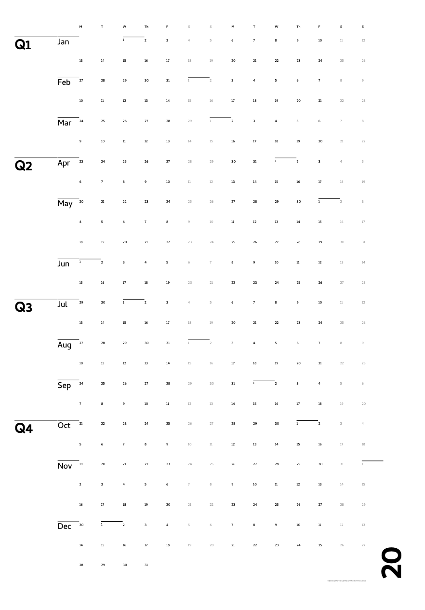

# A minimal-calendar print-optimised layout generator
Print-optimised minimal calendar layout for any year. Run on any given day of the year, will produce an HTML page with a full year calendar presented in a minimal layout, optimised and ready for printing.

Multiple ISO 216 paper sizes including: A0, A1, A2, A3 & A4.

# Requirements
- Any PHP enabled web server & `composer`.

# Installation
```bash
$ git clone git@github.com:chopstik/minimal-calendar.git
$ cd ./minimal-calendar
$ composer install
```

Then visit `http://localhost/minimal-calendar/` or the location of your cloned repo.

# Configuring size/style
To generate different ISO 216 page sizes, provide a query string value 0 ~ 4 corresponding to the desired output print size. Defaults to A4. This query string would produce a layout ready for output to A3:
```html
http://localhost/minimal-calendar/index.php?size=3
```

Adjust the typeface in the `<head>` tag in `index.php` as required to any available font, local or remote:
```html
<link href="https://fonts.googleapis.com/css?family=Cambay:400,700&display=swap" rel="stylesheet">`
```

Cambay typeface used as a default - other typefaces may respond differently to the relative CSS proportions. Adjust `css/main.css` as required.

# Printing
Ensure your OS has a print size to match the intended output: A0, A1, A2, A3 or A4. On macOS add an A0 or other size by using Page Setup in your browser. Look for **Paper Sizes** then **Manage Custom Sizes**, adding/editing your own page output size. ISO 216 A series page sizes can be found [here](https://en.wikipedia.org/wiki/ISO_216#Dimensions_of_A,_B_and_C_Series). In the print dialog the size you added/edited should be pre-selected and greyed out. Use the **Save as PDF** or **Open in Preview** to preview your calendar in PDF format.

# Acknowledgements
- Based on an idea by [@nickolaspeter](https://www.kickstarter.com/projects/nickolaspeter/a-hyper-minimal-calendar-for-2020)
- [HTML5Boilerplate](https://github.com/h5bp/html5-boilerplate), as always, always grateful
- [nyamsprod](https://github.com/nyamsprod) & [The League of Extraordinary Packages](https://period.thephpleague.com/)


